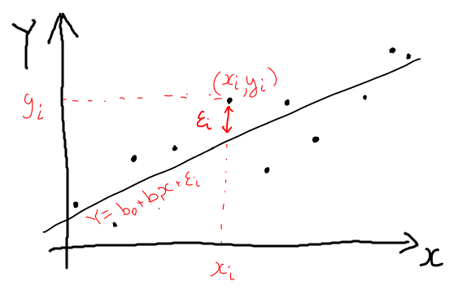
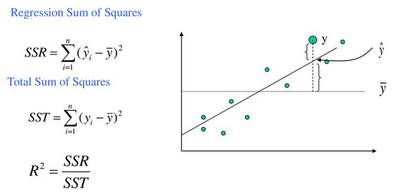
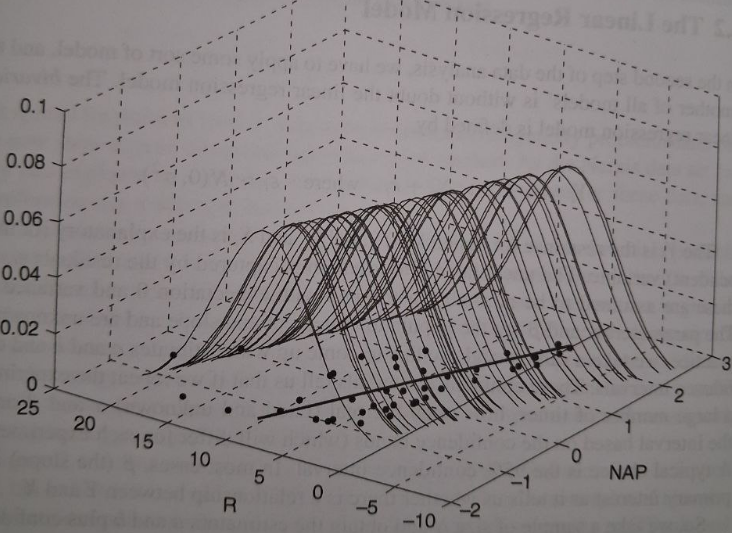

## Введение

* Регрессия
    - Регрессия в ML
    - Регрессия в статистике
      
* Статистика: о чем это вообще


## План

1. Парная линейная регрессия

2. Множественная линейная регрессия

3. Типичные проблемы

4. Нелинейные предикторы
   
   


## Необходимые библиотеки

```{python}
#| echo: true
import pandas as pd
import numpy as np

import seaborn as sns
import matplotlib.pyplot as plt

import statsmodels.api as sm
import statsmodels.formula.api as smf
```

PS При составлении примеров ни один подрядчик не пострадал.

## 1. Парная линейная регрессия

Пример: зависимость стоимости перевозок от веса посылки.

$X$ - вес груза.

$Y$ - стоимость перевозок, выставленная подрядчиком.

Подозрение: менеджер по логистике "дружит" с неким перевозчиком и проводит счета по завышенным ставкам.


## Диаграмма рассеяния груз (X) vs стоимость (Y):
```{python}
data = pd.read_csv('data/regression/example1.csv')
plt.figure()
sns.scatterplot(data=data, x='x', y='Y', style='suspect')
# sns.scatterplot(data=data, x='x', y='Y', style='speed')

data[['Y', 'x', 'suspect']].head(3)
```


## 1.1. Понятие линейной регрессии {.nostretch}

{fig-align="center" width=40%}

Уравнение регрессии (модель):

$$
Y_i = b_0 + b_1 x_i + \varepsilon_i,
$$

* $Y_i$ - значение независимой переменной для $i$-го примера;
* $x_i$ - значение зависимой переменной для $i$-го примера;
* $b_0$, $b_1$ - неизвестные коэффициенты, которые нужно оценить по данным;
* $\varepsilon_i \sim N(0, \sigma)$ - величина ошибки модели для $i$-го примера **(важно!!!)**;


## 1.2. Метод наименьших квадратов
Найдем средний квадрат ошибки:
$$
Err = \frac{1}{N} \sum_{i=1}^{n}  \varepsilon_i^2 = \frac{1}{N} \sum_{i=1}^{n}  (Y_i - b_0 - b_1 x_i)^2 \to \min_{b_0, b_1}
$$

Процедура поиска коэффициентов, минимизирующих средний квадрат ошибки, -- метод наименьших квадратов.

**Плюсы:**

* легко считать;
* хорошие стат.свойства (== развитая теория, == удобная проверка гипотез);

**Минусы:**

* чувствительность к выборосам;

## Коэффициент детерминации
**Метрика качества модели** -- коэффициент детерминации (== квадрат коэффициента корреляции Пирсона). 
Показывает долю дисперсии данных, которую объясняет модель.

$$
R^2 = [correlation]^2 =  \frac{Var(\hat Y)}{Var(Y)} = \frac{\sum(\hat Y - \overline Y)^2}{\sum(Y - \overline Y)^2}
$$

{fig-align="center" width=40%}

Для прикидок:

* если коэффициент детерминации равен 0.7, то это значит: 
  - модель объясняет 70% дисперсии данных ;
  - 30% - случайность или невыявленные причины.


## Регрессия в нашем примере

```{python}
#| echo: true

train_data = data.query('suspect != 1')  # отбросим "подозрительные" контракты
x = train_data[['x']]   # одна колонка -- вес посылки
y = train_data.Y

X = sm.add_constant(x)   # добавим еще колонку из единиц 

model = sm.OLS(y, X)
results = model.fit()
print(results.summary())

```


## На что смотрим в первую очередь


```{python}
#| echo: false
print(results.summary())
```


:::: {.columns}

::: {.column width="50%"}

1. Коэффициенты:

const (-3.1469): свободный член, статистически незначим (p=0.785)

x (0.2228): P>|t| (0.000): коэффициент x статистически значим

:::

::: {.column width="50%"}

2. Метрики качества модели:

R-squared (0.621): модель объясняет 62.1% дисперсии переменной Y

Prob (F-statistic) (1.06e-06): модель статистически значима (p < 0.05)


3. Диагностика остатков (Durbin-Watson; Omnibus/Jarque-Bera; ...)

:::

::::

## 1.3. Диагностика-1
Сообщение из отчета: *Standard Errors assume that the covariance matrix of the errors is correctly specified.*

**Означает:**

Показатели в таблице рассчитаны в предположении, что данные соответствуют требованиям регрессионного анализа (гомоскедастичность и отсутствие автокреляции).

Что подразумевается под "соотвествуют требованиям":

$$
Y_i = b_0 + b_1 x_i + \varepsilon_i, \quad \varepsilon_i \sim N(0, \sigma)
$$

## 1.3. Диагностика-2 {.nostretch}
$$
Y_i = b_0 + b_1 x_i + \varepsilon_i, \quad \varepsilon_i \sim N(0, \sigma)
$$

{fig-align="center" width=50%}


* Ошибки гомоскедастичны: дисперсия остатков постоянна и не зависит от значений X (нет гетероскедастичности).
* Ошибки независимы: нет автокорреляции остатков (наблюдения не связаны между собой во времени или пространстве).
* Нет систематической связи между ошибками и переменными.


## 1.3. Диагностика-3 {.nostretch}

```{python}
#| echo: true
 
residuals = results.resid

fig, (ax1, ax2) = plt.subplots(1, 2)
ax1.scatter(range(len(residuals)), residuals, alpha=0.6, color='darkblue', s=50)
ax1.set_xlabel('Номер примера')
ax1.set_ylabel('Остатки')
ax1.grid(True, alpha=0.3)
ax2.hist(residuals, bins=10, color='darkblue', edgecolor='black', alpha=0.7)
ax2.axvline(x=0, color='darkred', linestyle='-', linewidth=1.5)
ax2.set_xlabel('Остатки')
ax2.set_ylabel('Частота')
ax2.grid(True, alpha=0.3, axis='y')
plt.show()
```


## Решили: давайте "поверим" модели

Смотрим еще раз на вывод:

```{python}
#| echo: false
print(results.summary())
```


## Модифицируем модель

```{python}
#| echo: true

train_data = data.query('suspect != 1')  # отбросим "подозрительные" контракты
x = train_data[['x']]   # одна колонка -- вес посылки
y = train_data.Y

model = sm.OLS(y, x)
results = model.fit()
print(results.summary())
```

## Диагностика второй модели

```{python}
#| echo: true
 
residuals = results.resid

fig, (ax1, ax2) = plt.subplots(1, 2)
ax1.scatter(range(len(residuals)), residuals, alpha=0.6, color='darkblue', s=50)
ax1.set_xlabel('Номер примера')
ax1.set_ylabel('Остатки')
ax1.grid(True, alpha=0.3)
ax2.hist(residuals, bins=10, color='darkblue', edgecolor='black', alpha=0.7)
ax2.axvline(x=0, color='darkred', linestyle='-', linewidth=1.5)
ax2.set_xlabel('Остатки')
ax2.set_ylabel('Частота')
ax2.grid(True, alpha=0.3, axis='y')
plt.show()
```

## 1.4. Так что же там с ценой перевозок?
```{python}
#| echo: true
data_sorted = data.sort_values(by='x')
# Получаем предсказания
predictions = results.get_prediction(data_sorted.x)
pred_summary = predictions.summary_frame(alpha=0.05)  # 95% интервалы

plt.figure()
sns.scatterplot(data=data, x='x', y='Y', style='suspect', s=80)
# Линия регрессии
plt.plot(data_sorted.x, pred_summary['mean'], color='red', linewidth=2.5, label='Линия регрессии')
# Доверительный интервал (для среднего)
plt.fill_between(data_sorted.x, pred_summary['mean_ci_lower'], pred_summary['mean_ci_upper'], color='red', alpha=0.2, label='95% доверительный интервал')
# Интервал предсказания (для новых наблюдений)
plt.fill_between(data_sorted.x, pred_summary['obs_ci_lower'], pred_summary['obs_ci_upper'], 
                 color='gray', alpha=0.15, label='95% интервал предсказания')

plt.xlabel('x'); plt.ylabel('Y')
plt.legend(); plt.show()
```


## 1.4. Так что же там с ценой перевозок?
```{python}
#| echo: false
data_sorted = data.sort_values(by='x')
# Получаем предсказания
predictions = results.get_prediction(data_sorted.x)
pred_summary = predictions.summary_frame(alpha=0.05)  # 95% интервалы

plt.figure()
sns.scatterplot(data=data, x='x', y='Y', style='suspect', s=80)
# Линия регрессии
plt.plot(data_sorted.x, pred_summary['mean'], color='red', 
         linewidth=2.5, label='Линия регрессии')
# Доверительный интервал (для среднего)
plt.fill_between(data_sorted.x, pred_summary['mean_ci_lower'], pred_summary['mean_ci_upper'], 
                 color='red', alpha=0.2, label='95% доверительный интервал')
# Интервал предсказания (для новых наблюдений)
plt.fill_between(data_sorted.x, pred_summary['obs_ci_lower'], pred_summary['obs_ci_upper'], 
                 color='gray', alpha=0.15, label='95% интервал предсказания')

plt.xlabel('x')
plt.ylabel('Y')
plt.title('Регрессия с доверительным интервалом и интервалом предсказания')
plt.legend()
plt.show()
```


## Промежуточный итог
Модель:
$$
Y_i =  b_1 x + \varepsilon_i, \quad \varepsilon_i \sim N(0, \sigma)
$$

Конкретные параметры регрессии:
```{python}
#| echo: false

print('STD(epsilon)', np.sqrt(results.mse_resid))
print('Coefs:')
results.params
```

$$
Y_i =  0.2139 x + \varepsilon_i, \quad \varepsilon_i \sim N(0, 21.5)
$$

**Интерпретация:** при увеличении веса на одну единицу стоимость увеличивается на 0.2139 единиц.


**Замечание:** регрессия не магия, а поиск "цифровой середины". В нашем случае -- не надо проверять 100% накладных, достаточно проверить 5% наиболее подозрительных.


## 2. Множественная линейная регрессия

```{python}
plt.figure()
sns.scatterplot(data=data, x='x', y='Y', style='speed')

data.head(5)
```
Решили "копнуть глубже"

## Уравнение

$$
Y_i = b_0 + \sum_{j=1}^K b_j x_i + \varepsilon_i,
$$

* $Y_i$ - значение независимой переменной для $i$-го примера;
* $x_i$ - значение зависимой переменной для $i$-го примера;
* $b_0$, $b_1, \dots, b_K$ - неизвестные коэффициенты, которые нужно оценить по данным;
* $\varepsilon_i \sim N(0, \sigma)$ - величина ошибки модели для $i$-го примера;

**Диагностика:**

* среднее ошибки 0;
* постоянная дисперсия ошибки;
* нет систематической связи между ошибками и ВСЕМИ переменными.
  

## Модель
```{python}
#| echo: true

train_data = data.query('suspect != 1')  # отбросим "подозрительные" контракты
x = train_data[['x', 'speed']]   
y = train_data.Y

X = sm.add_constant(x)   # добавим еще колонку из единиц 

new_model = sm.OLS(y, X)
new_results = new_model.fit()
print(new_results.summary())

```

## Диагностика-0


## Модель  
```{python}
#| echo: true

train_data = data.query('suspect != 1')  # отбросим "подозрительные" контракты
x = train_data[['x', 'speed']]   
y = train_data.Y

new_model = sm.OLS(y, x)
new_results = new_model.fit()
print(new_results.summary())

```


## Диагностика-1

```{python}
#| echo: true
 
residuals = new_results.resid

fig, (ax1, ax2) = plt.subplots(1, 2)
ax1.scatter(range(len(residuals)), residuals, alpha=0.6, color='darkblue', s=50)
ax1.set_xlabel('Номер примера')
ax1.set_ylabel('Остатки')
ax1.grid(True, alpha=0.3)
ax2.hist(residuals, bins=10, color='darkblue', edgecolor='black', alpha=0.7)
ax2.axvline(x=0, color='darkred', linestyle='-', linewidth=1.5)
ax2.set_xlabel('Остатки')
ax2.set_ylabel('Частота')
ax2.grid(True, alpha=0.3, axis='y')
plt.show()
```


## Диагностика-2

Возможно, есть закономерность в остатках (от Y). Это нехорошо :( Но это показатель, что (вероятно) есть еще один неучтенный предиктор.
```{python}
#| echo: true
 
fig, (ax1, ax2, ax3) = plt.subplots(1, 3)
ax1.scatter(train_data.Y, residuals, alpha=0.6, color='darkblue', s=50)
ax1.set_xlabel('стоимость (Y)')
ax1.set_ylabel('Остатки')
ax1.grid(True, alpha=0.3)
ax2.scatter(train_data.x, residuals, alpha=0.6, color='darkblue', s=50)
ax2.set_xlabel('Вес груза (X)')
ax2.set_ylabel('Остатки')
ax2.grid(True, alpha=0.3)
ax3.scatter(train_data.speed, residuals, alpha=0.6, color='darkblue', s=50)
ax3.set_xlabel('Скоропорт?')
ax3.set_ylabel('Остатки')
ax3.grid(True, alpha=0.3)

plt.show()
```


## Промежуточный итог - 2
Новая модель:
$$
Y_i =  b_1 weight + b_2 speed + \varepsilon_i, \quad \varepsilon_i \sim N(0, \sigma)
$$

Конкретные параметры регрессии:
```{python}
#| echo: false

print('STD(epsilon)', np.sqrt(new_results.mse_resid))
print('Coefs:')
new_results.params
```

$$
Y_i =  0.2 weight + 22.8 speed + \varepsilon_i, \quad \varepsilon_i \sim N(0, 19.4)
$$

**Интерпретация:** 

* при увеличении веса на одну единицу стоимость увеличивается на 0.2 единиц.
* "доплата за скорость" - 22.8 единиц (сдвигает линию регрессии вверх).


## Диагностика-3

Итого 2 модели с разным набором предикторов (см. описание `result.summary()`). 

Пусть $L$ - значение функции правдоподобия, $k$ -- число параметров модели, $n$ -- число примеров.
Показатели точности/переобучения моделей:

* BIC (Байесовский информационный критерий): $-2  \ln(L) + k  \ln(n)$ (несколько клонен к недообучению);
* AIC (Информационный критерий Акаике): $aic = -2  \ln(L) + 2k$ (несколько склонен к переобучению).

```{python}
#| echo: false

print('AIC old:', round(results.aic), 'BIC old:', round(results.bic))
print('AIC new:', round(new_results.aic), 'BIC new:', round(new_results.bic))

```

**Как читать?**
Сравниваем несколько моделей.

* Чем меньше значение BIC/AIC, тем лучше модель.
* Абсолютная величина не важна, важна разность на одних и тех же данных.
* Грубое правило:
    * Если разница в AIC/BIC между двумя моделями меньше 2: модели практически неотличимы по качеству.
    * Разница от 4 до 7: есть серьезные основания предпочесть модель с меньшим значением.
    * Разница больше 10: модель с меньшим значением однозначно лучше.


## Модель 2: графики

```{python}
# Создаем данные для предсказания
x_range = np.linspace(train_data['x'].min(), train_data['x'].max(), 50)

# Для speed=0
x_pred_0 = pd.DataFrame({'x': x_range, 'speed': 0})
pred_0 = new_results.get_prediction(x_pred_0)
summary_0 = pred_0.summary_frame(alpha=0.05)

# Для speed=1
x_pred_1 = pd.DataFrame({'x': x_range, 'speed': 1})
pred_1 = new_results.get_prediction(x_pred_1)
summary_1 = pred_1.summary_frame(alpha=0.05)

plt.figure(figsize=(12, 8))

# Исходные точки по группам
sns.scatterplot(data=data, x='x', y='Y', style='suspect', s=80)

# Линии регрессии и интервалы для speed=0
plt.plot(x_range, summary_0['mean'], 'b-', linewidth=2, label='speed=0 (регрессия)')
plt.fill_between(x_range, summary_0['obs_ci_lower'], summary_0['obs_ci_upper'], 
                 color='blue', alpha=0.1, label='speed=0 (интервал предсказания)')

# Линии регрессии и интервалы для speed=1
plt.plot(x_range, summary_1['mean'], 'orange', linewidth=2, label='speed=1 (регрессия)')
plt.fill_between(x_range, summary_1['obs_ci_lower'], summary_1['obs_ci_upper'], 
                 color='orange', alpha=0.1, label='speed=1 (интервал предсказания)')

plt.xlabel('x')
plt.ylabel('Y')
plt.title('Регрессия с двумя группами (speed=0 и speed=1)')
plt.legend()
plt.show()
```

Согласно этой модели, "подозрительные" накладные укладываются в интервал предсказания для группы "скоропорта".  

## Вывод по "расследованию"

Итак, есть ли "криминал"? Скорее нет, чем да:

1. Имеем дело с пограничным случаем (две модели говорят разное).
2. Вторая модель согласно информационным критериям точнее первой (но незначительно).
3. Но нет полной уверенности в том, что вторая модель точно определена (возможно, есть нарушение условия независимости ошибок: чем больше прогноз модели, тем выше ошибка).


На этом остановимся.

Если бы передо мной стояла такая задача в реальной жизни, то рекомендации таковы:

* собрать больше данных:
 - что будем делать по итогам "расследования" (этические проблемы)
 - больше примеров на перевозку "скоропорта", для большей надежности модели.
   
Подчеркну еще раз:

- регрессия не волшебная палочка, а поиск "цифровой середины".


## Пример 2.

Стоимость доставки:

* $x_1$ - длина пути, $x_2$ -- вес груза, $x_3$ -- объем груза;
* $Y$ - цена подрядчика.

$Cost = b_0 + b_1 DIST + b_2 WGT + b_3 VOL$
```{python}
#| echo: true
#| 
data = pd.read_csv('data/regression/example2.csv')

x = data[['dist', 'wgt', 'vol']]
y = data.cost + 300*np.random.randn(150)

X = sm.add_constant(x)   # добавим еще колонку из единиц 

model1 = sm.OLS(y, X)
results1 = model1.fit()
print(results1.summary())
```

## Диагностика

```{python}
#| echo: true
 
residuals = results1.resid

fig, (ax1, ax2) = plt.subplots(1, 2)
ax1.scatter(range(len(residuals)), residuals, alpha=0.6, color='darkblue', s=50)
ax1.set_xlabel('Номер примера')
ax1.set_ylabel('Остатки')
ax1.grid(True, alpha=0.3)
ax2.hist(residuals, bins=10, color='darkblue', edgecolor='black', alpha=0.7)
ax2.axvline(x=0, color='darkred', linestyle='-', linewidth=1.5)
ax2.set_xlabel('Остатки')
ax2.set_ylabel('Частота')
ax2.grid(True, alpha=0.3, axis='y')
plt.show()
```


## Диагностика-2

```{python}
#| echo: true
 
fig, [(ax1, ax2), (ax3, ax4)] = plt.subplots(2, 2)
ax1.scatter(data.cost, residuals, alpha=0.6, color='darkblue', s=50)
ax1.set_xlabel('стоимость (Y)')
ax1.set_ylabel('Остатки')
ax1.grid(True, alpha=0.3)
ax2.scatter(data.wgt, residuals, alpha=0.6, color='darkblue', s=50)
ax2.set_xlabel('Вес груза (X)')
ax2.set_ylabel('Остатки')
ax2.grid(True, alpha=0.3)
ax3.scatter(data.dist, residuals, alpha=0.6, color='darkblue', s=50)
ax3.set_xlabel('Расстояние')
ax3.set_ylabel('Остатки')
ax3.grid(True, alpha=0.3)
ax4.scatter(data.vol, residuals, alpha=0.6, color='darkblue', s=50)
ax4.set_xlabel('Объем')
ax4.set_ylabel('Остатки')
ax4.grid(True, alpha=0.3)
plt.show()
```

## Модель 2:
$Cost = b_0 + b_1 DIST + b_2 WGT$
```{python}
#| echo: true

x = data[['dist', 'wgt', ]] 
y = data.cost

X = sm.add_constant(x)   # добавим еще колонку из единиц 

model2 = sm.OLS(y, X)
results2 = model2.fit()
print(results2.summary())
```

## Диагностика

```{python}
#| echo: true
 
residuals = results2.resid

fig, (ax1, ax2) = plt.subplots(1, 2)
ax1.scatter(range(len(residuals)), residuals, alpha=0.6, color='darkblue', s=50)
ax1.set_xlabel('Номер примера')
ax1.set_ylabel('Остатки')
ax1.grid(True, alpha=0.3)
ax2.hist(residuals, bins=10, color='darkblue', edgecolor='black', alpha=0.7)
ax2.axvline(x=0, color='darkred', linestyle='-', linewidth=1.5)
ax2.set_xlabel('Остатки')
ax2.set_ylabel('Частота')
ax2.grid(True, alpha=0.3, axis='y')
plt.show()
```

## Диагностика-2

```{python}
#| echo: true
 
fig, [(ax1, ax2), (ax3, ax4)] = plt.subplots(2, 2)
ax1.scatter(data.cost, residuals, alpha=0.6, color='darkblue', s=50)
ax1.set_xlabel('стоимость (Y)')
ax1.set_ylabel('Остатки')
ax1.grid(True, alpha=0.3)
ax2.scatter(data.wgt, residuals, alpha=0.6, color='darkblue', s=50)
ax2.set_xlabel('Вес груза (X)')
ax2.set_ylabel('Остатки')
ax2.grid(True, alpha=0.3)
ax3.scatter(data.dist, residuals, alpha=0.6, color='darkblue', s=50)
ax3.set_xlabel('Расстояние')
ax3.set_ylabel('Остатки')
ax3.grid(True, alpha=0.3)
ax4.scatter(data.vol, residuals, alpha=0.6, color='darkblue', s=50)
ax4.set_xlabel('Объем')
ax4.set_ylabel('Остатки')
ax4.grid(True, alpha=0.3)
plt.show()
```

## Общие выводы

1. Диагностика моделей - обязательна. Проверяем остатки:
    - среднее 0;
    - дисперсия остатков постоянна;
    - остатки не показывают паттернов в поведении и зависимостей от переменных.
      
2. Оцениваем модели по:
    - $R^2$ -- точность;
    - BIC/AIC -- выбор моделей, страховка от переобучения.

3. Лишние предикторы также плохи, как и их недостаток:
    - паттерны в поведении остатков часто свидельствуют о неучтенных предикторах (или нелинейной связи);
    - точная модель со статистически незначимыми коэффициентами намекает на лишний предиктор.
